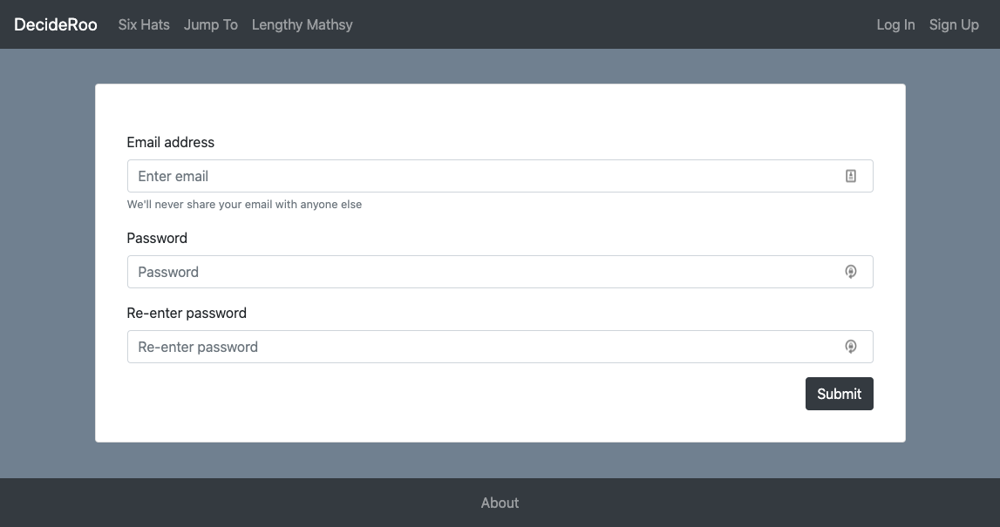
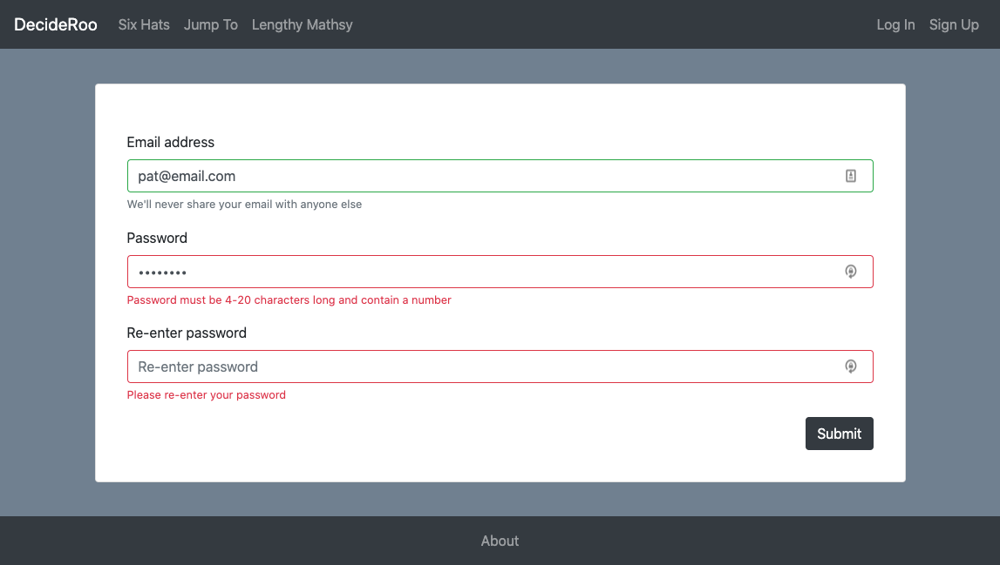
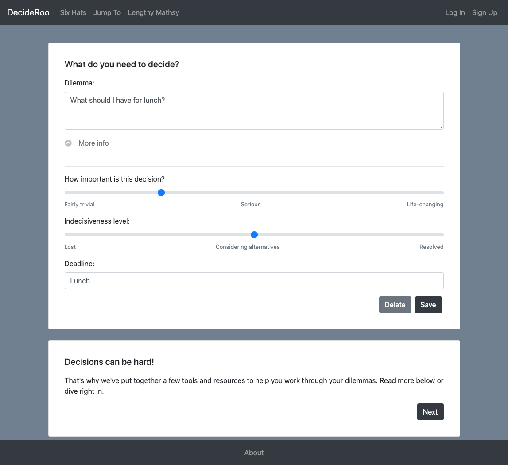
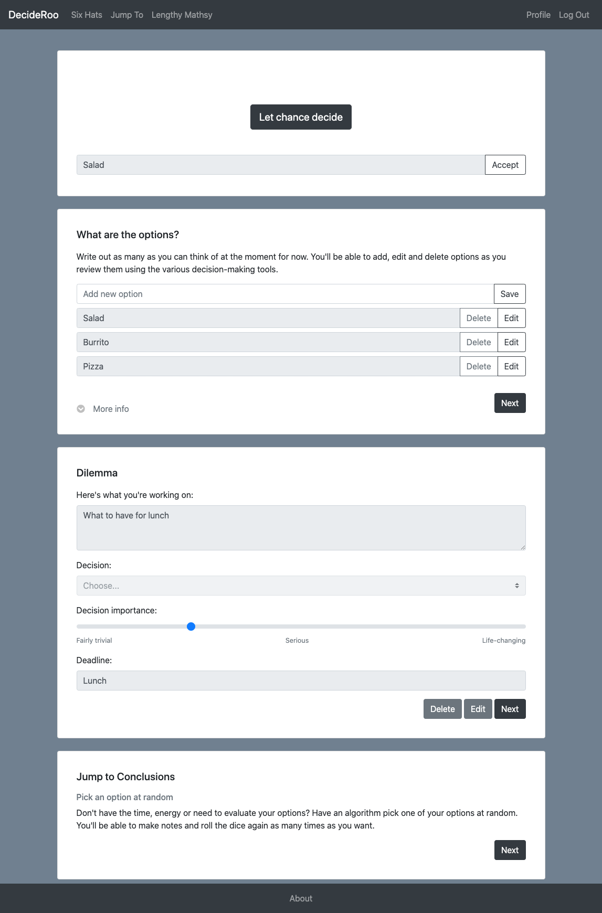

A React solo project aiming to provide a set of interactive tools for working through the decision making process. This is a work in progress, with one working tool and two further tools in the works.

* [GitHub front end](https://github.com/anya-pich/DecideRoo)
* [GitHub back end](https://github.com/anya-pich/decideroo-backend)
* [Deployed](https://decideroo.herokuapp.com/) | demo login: pat@email.com p: pattern5

## Motivation

Decisions can be hard! There are decision-making models out there but no easily available tools to help people apply them in their daily lives. The MVP will offer three tools that can be interchangeably be used to examine each decision to be made:

1. Jump to Conclusions - analyse your problem by writing it out and brainstorming your options. This tool will pick an option at random and give you an option to accept the chosen option or pick again.
2. 6 hats - consider your conundrum from 6 different perspectives, drag & drop your decision options to what you think each perspective might endorse, and optionally discuss each perspective.
3. Long-form analysis - this one will give you tools and options to dig deeper into your problem definition, context and compare and contrast decision options using weighting scales.

## Screenshots

## Features

* Custom React hooks for form input processing & validation
* User authentication with form validation on both front & back ends
* Custom animated accordion component

#### To do:

- UI revamp
- Debug jump to conclusions route
- Build Six Hats route
- Build detailed analysis route
- Implement local storage so that tools can be used without loggin in

#### Future features:
- Animate the roo
- Follow-up on decision outcomes
- Other decision-making tools

## Tech used

* React
* JavaScript, HTML, CSS
* Bootstrap
* MongoDB
* Express
* Node