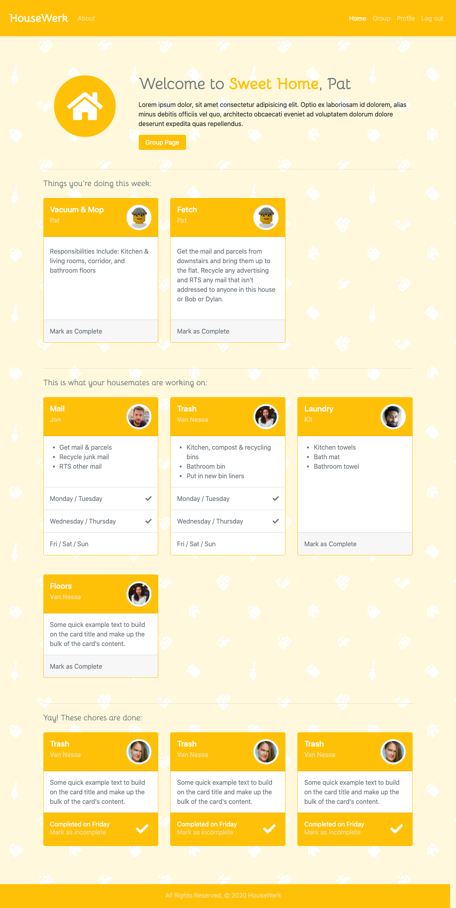
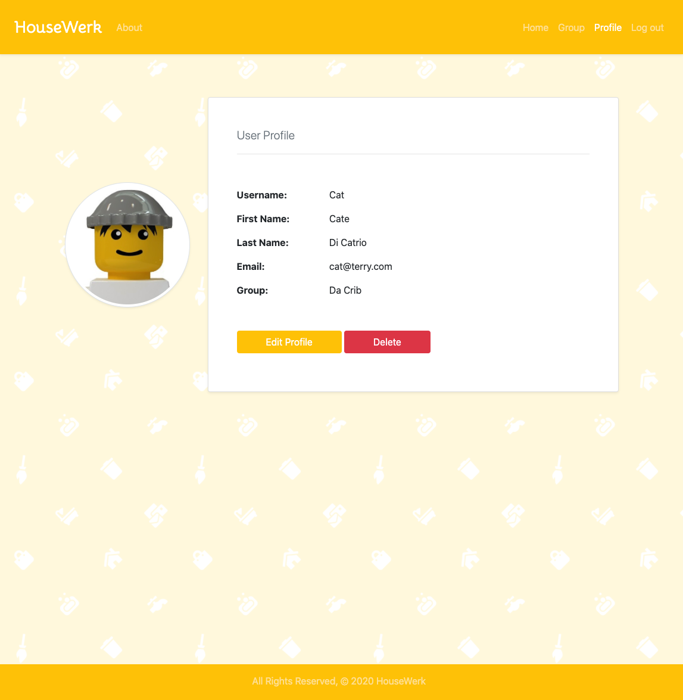

Web platform for managing chores in households. Team project built with Django, Bootstrap and PostgreSQL. It is mostly functional, with some chore management functionality on the front end still needing work to reach MVP stage.

* [GitHub](https://github.com/anya-pich/housewerk)
* [Deployed](https://immense-temple-95604.herokuapp.com/) | demo login: pat p: patterns

## Motivation

This project was created to make it easy for households to look after their homes together. Using this responsive platform, housemates or families are able to set up a group for their home, add weekly chores, and track their progress online.

## Design

## Screenshots

## Build Status

The site is mostly functional and deployed. Some work on the front end is still required to achieve usable MVP.

#### Functional features:
* User and admin user CRUD
* Create and manage user groups
* Create and assign chores

#### To do:
* Completing chores
* Chores to automatically rotate to a different user every time period

## Tech used

* Bootstrap
* Django
* PostgreSQL
* Python