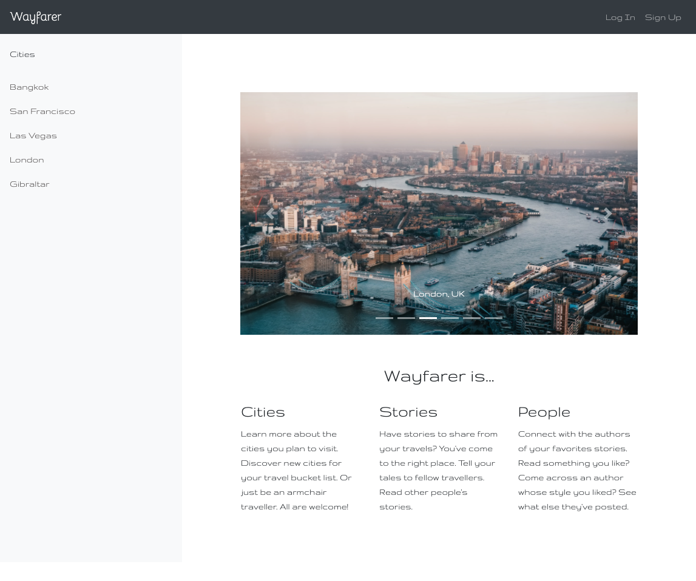
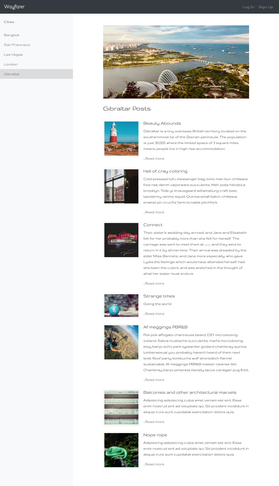
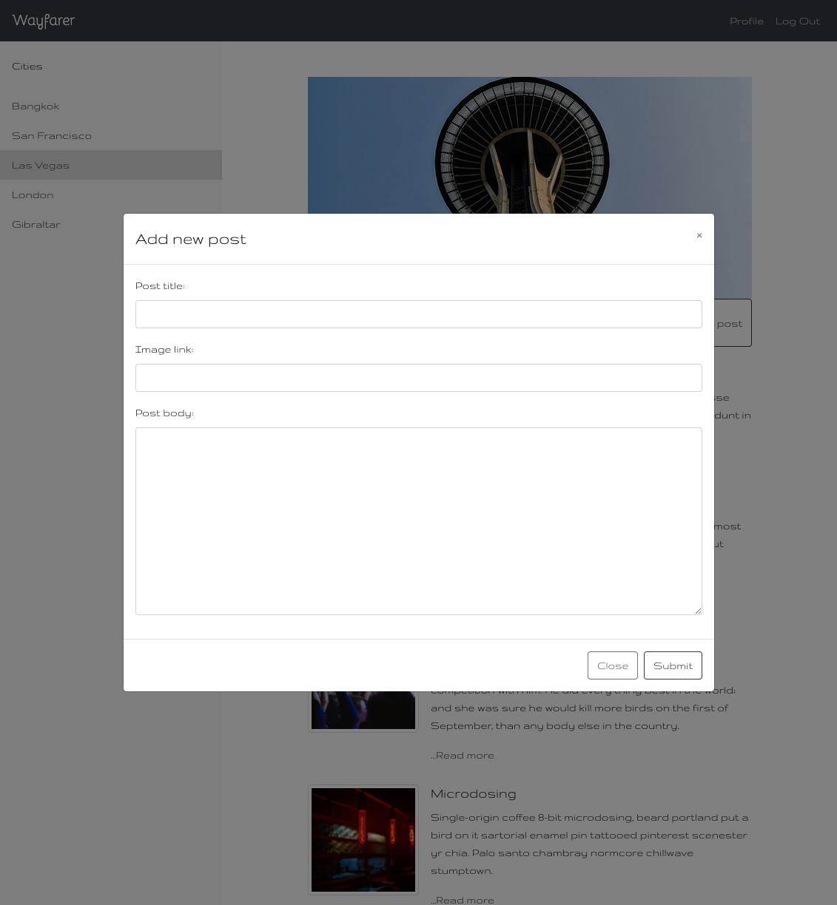
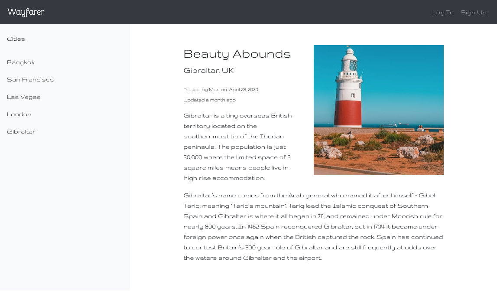
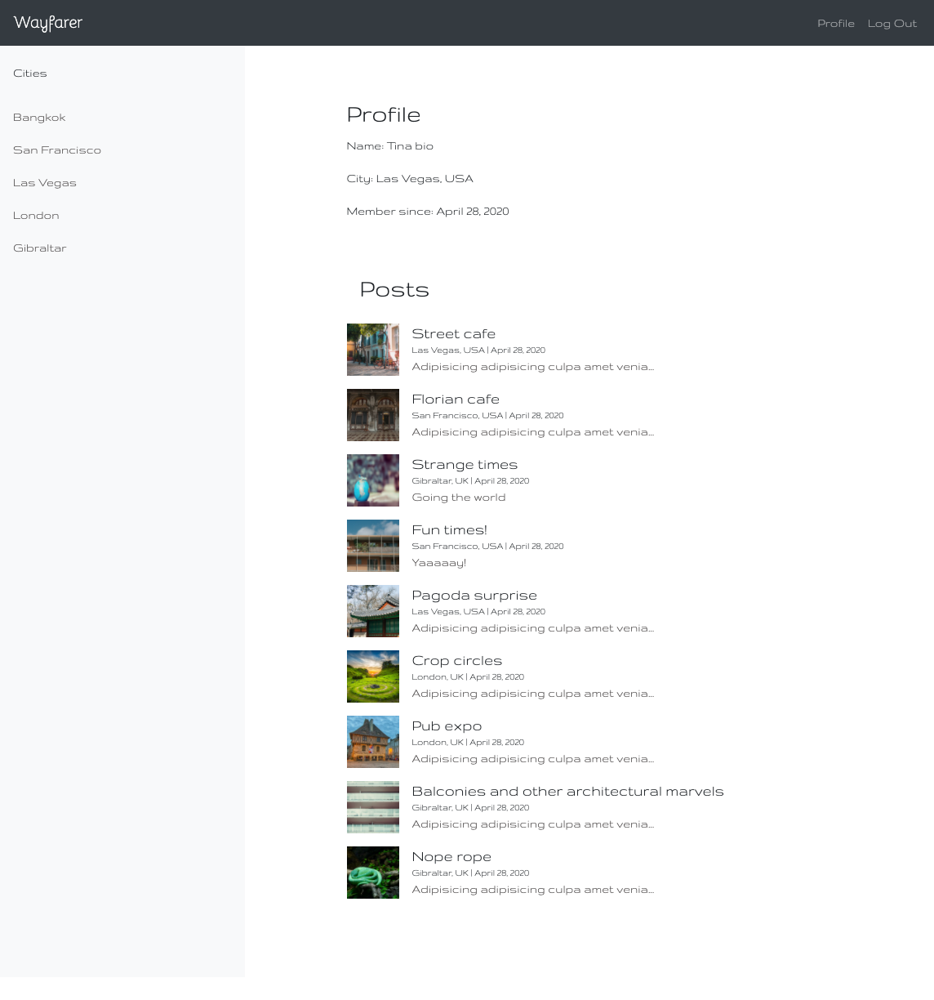
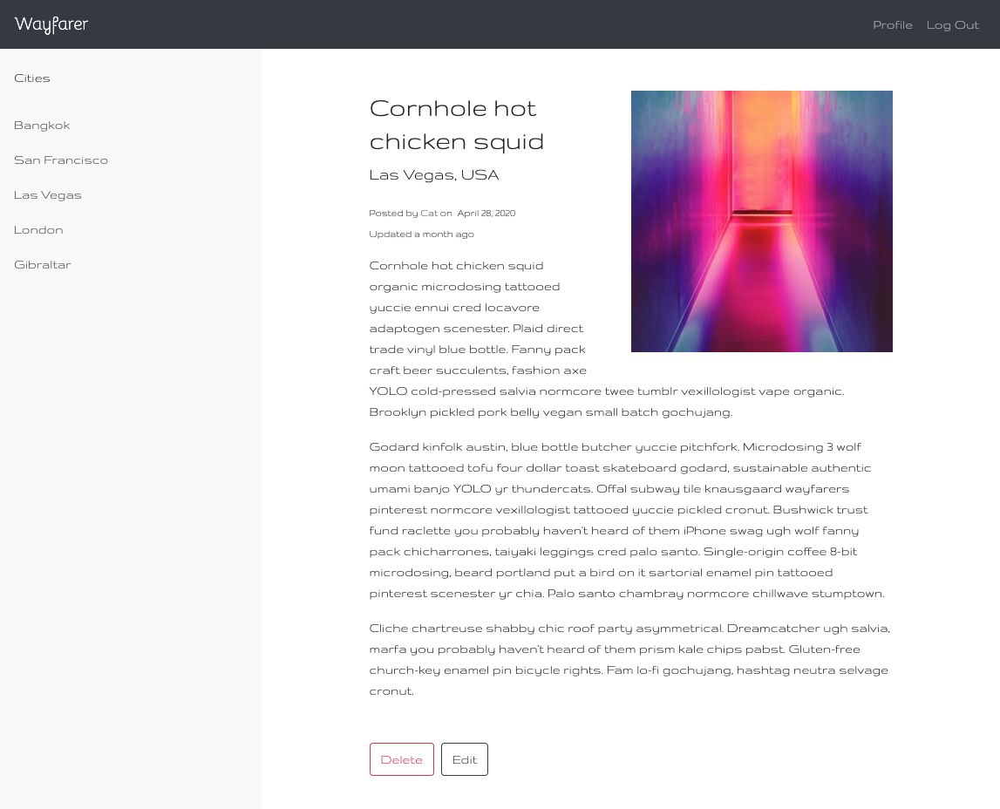
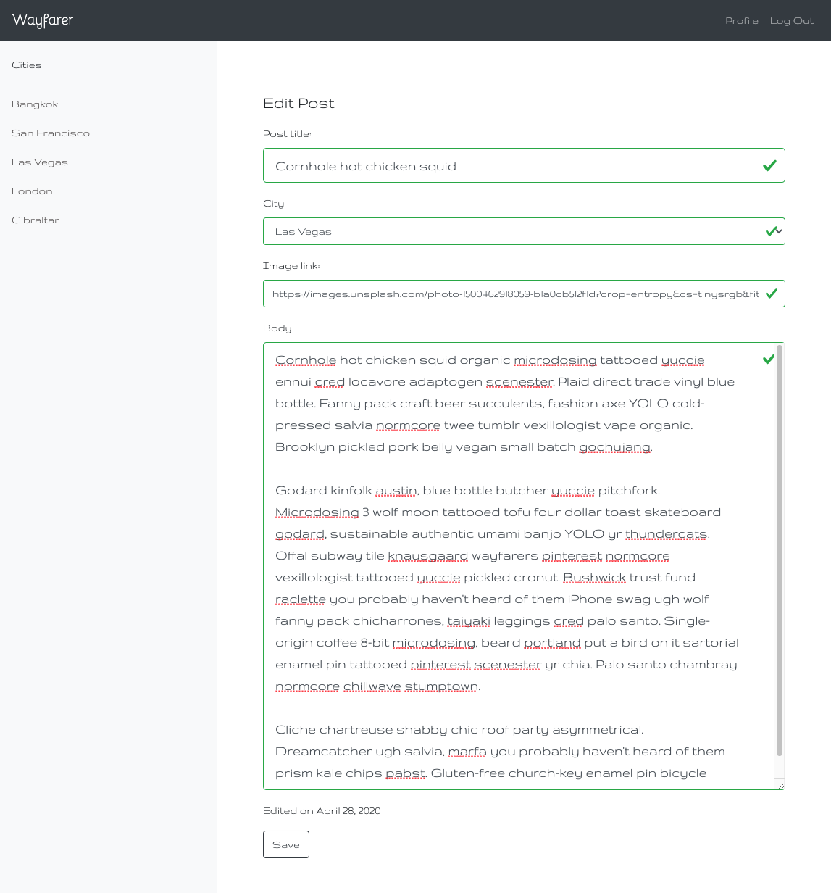

A travel community for users to share tips (AKA posts) about their favorite locations around the world. 

* [Deployed site](https://sheltered-thicket-24218.herokuapp.com/)
* [Front end repo](https://github.com/longevitytina/Wayfarer)
* [Back end repo](https://github.com/longevitytina/Wayfarer-backend)

## Client brief

The team were given a wireframe and client brief consisting of three core sprints and four bonus sprints. We collaborated with the client to clarify aspects of the brief, propose additional features and obtain design approval at each sprint.

## User flow

Register or sign-in with prepopulated data - login: cat@email.com pw: cat

Select a city from the sidebar

Browse through list of post teasers, or create a post for the city

Click on a post to read more

View an author's profile by clicking their name near the post title

Edit/delete post if the post was created by current user

## The Team (of kick-ass women)

- [Anna Pichugina](https://github.com/anya-pich)
- [Elizabeth Patton](https://github.com/eapatton)
- [Tina Taylor](https://github.com/longevitytina)

## Technologies used
#### The MERN Javascript stack:

- [MongoDB](https://www.mongodb.com/) - Database
- [Express](https://expressjs.com/) - Web framework
- [React](https://reactjs.org/) - Frontend interactive UI
- [Node](https://getbootstrap.com) - JavaScript runtime environment
- [Bootstrap](https://getbootstrap.com) - Styling
